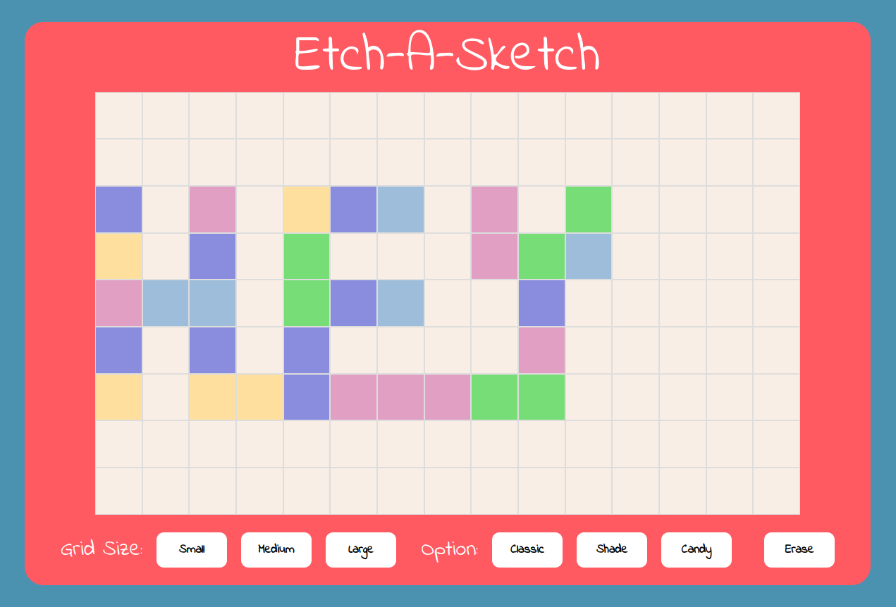

# etch-a-sketch

Live: https://glonky1337.github.io/etch-a-sketch/

An Etch-a-Sketch Game built with HTML, CSS, and JavaScript.

## What I learned

### HTML:
- Semantic HTML: The HTML code uses semantic tags to describe the content of the website, such as "header", "section", "main", and "footer".
- Responsive design: The website is designed to be responsive using the "viewport" meta tag, which ensures that the website adapts to different screen sizes and orientations.

### CSS:
- Font Import: The font "Indie Flower" is imported from Google Fonts and set as the default font for the body element.
- Box model: The layout of individual elements on the page is defined using properties like "height", "width", "border", and "padding".
- Flexbox layout: The webpage layout is created using the "display: flex" property, allowing for a responsive layout that adapts to different screen sizes.
- CSS Grid: The "display: grid" property is used to create a grid layout for the #grid-container element with custom grid row and column sizes.
- Button Styling: The buttons on the page are styled with a unique hover effect using the "after" pseudo-element and "transition" property.

### JavaScript:
- Global variables: A global variable named 'globalColor' is set with an initial value of 'classic', and a constant variable named 'gridContainer' is set to reference the HTML element with the id of 'grid-container'.
- generateGrid() function: A function is defined with two parameters, rows and columns, which sets the CSS variables --grid-rows and --grid-columns for the gridContainer, and creates a number of div elements with the class name "grid-item" equal to the product of the rows and columns parameters. Each created cell element has a mouseover event listener that changes its background color and opacity depending on the value of the globalColor variable.
- generateCandyColors() function: A function is defined that returns a random color from an array of predefined pastel candy colors.
- Event listeners: Four event listeners are set up to change the globalColor variable to different values ('classic', 'overlay', 'candy', and undefined), and to erase the grid when a button is clicked.
- removeGrid() function: A function is defined to remove all child elements of the gridContainer element.
- Grid options: Three buttons are set up to create a grid of different sizes (small, medium, large) when clicked, using the removeGrid() and generateGrid() functions.
- eraseGrid() function: A function is defined to erase the color and opacity properties of all cells with the class name "grid-item".
